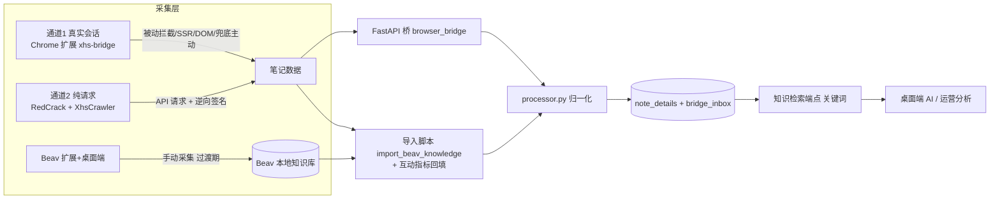

# 方案 v1.4：AiRestro 小红书采集 — 风控优化 + Beav 四方向落地（内部桌面工具版）

> 状态：待评审定稿 ｜ 更新：2026-08-08 ｜ 配套文档：`BEAV-4PILLARS-INTEGRATION.md`、`BEAV-IMPORT-MAPPING.md`
> 本文是唯一权威方案；如与旧版文档冲突，以本文为准。

## 评审修订记录（v1.0 → v1.1）

| # | 评审意见 | v1.1 处理 |
|---|---|---|
| R1 | 参数目标值无数据依据 | §1.2 标注为"初始保守基线"；新增 §1.4 风控观测与校准闭环，用实际失败率数据回调参数 |
| R2 | 吞吐量砍 70-75% 可能影响业务覆盖 | §1.2 明确"上限是安全阀不是吞吐目标"；新增覆盖预算公式与业务确认项 |
| R3 | Beav 数据授权边界不清（软件 vs 数据两条线） | 新增 §6.1 数据授权边界：MIT-NC 管软件，数据授权取决于小红书用户协议；自建扩展不改变数据授权性质 |
| R4 | 方向三安全护栏覆盖不全、工期偏乐观 | §3 方向三改为"白名单动作集 + 黑名单兜底 + CDP 写请求拦截 + 二次确认"四层；阶段 5 拆 5a/5b，工期重估 5-8 天 |

### v1.1 → v1.2

| # | 评审意见 | v1.2 处理 |
|---|---|---|
| R5 | 校准规则 1‰–1% 中间地带无对应动作 | §1.4 改为分级校准阶梯（5 档）+ 样本量门槛 + 调整后重置观察窗 |
| R6 | 覆盖预算公式未代入真实数据，且"待业务确认"悬空 | 新增 §0.2，用实查数据代入（8 订阅 / 522 详情 / 头部 198、150），并提前到阶段 0 定案 |
| R7 | §6.1"数据最小化留存"与 bridge_inbox"长期保留原始收件"方向矛盾 | §5 新增 bridge_inbox 留存与清理策略，§6.1 对齐：TTL、重放成功即清理、字段最小化、媒体不入 inbox |
| R8 | §6.1 只解决"抓到后怎么存/用"，未覆盖"抓取行为本身"的上游合规 | §6.1 新增上游/下游边界声明，明确本方案不构成对整体合规性的解决 |
| R9 | 文档卫生：§7/§1.2 仍留旧问句，与 §0.2 新结论叠置 | §1.2 改为指向 §0.2 结论并列出剩余两个问题；§7 重写下一步措辞 |
| R10 | 补充工程细节 | 新增附录 A（crawl_request_log 表结构）、附录 B（阶段 5a/5b 验收用例） |

---

## 0. 项目定位（已确认的事实）

| 项 | 结论 |
|---|---|
| 产品形态 | **内部桌面工具**（非 SaaS），本机运行 `python start_services.py` |
| 核心需求 | **降低风控**（在风控预算内最大化有效采集） |
| 网络形态 | 本地桌面直连（真实国内宽带 IP）——**不需要代理池** |
| 已有资产 | RedCrack、XhsCrawler、RiskGate、tasks.py、note_details、subscriptions、APScheduler |
| 已跑通 | Beav 桌面端 2.6.31（运行中）、Beav 扩展 2.6.19（可加载）、已采 10 条数据 |
| 已知痛点 | `user_posted data:null`、`x-rap-param 间歇失败`、Cookie 易失效、Beav 数据缺互动指标 |

## 0.1 关键决策记录（已确认）

1. 平台范围：本期只做小红书，扩展保留多平台适配器接口
2. 通道形态：Chrome 扩展（被动采集最稳）
3. 存储落点：本地 PostgreSQL `note_details` + 新增 `bridge_inbox`（原始收件可回放）
4. 向量检索：本期不上，先关键词（ILIKE）
5. 调度归属：采集由扩展侧队列驱动；订阅/分析继续 APScheduler（预留 Celery Beat）
6. 代理池：不用（直连最稳；代码保留 proxy_pool 参数供未来扩展）
7. Beav 定位：过渡期采集工具（内部使用）；长期由自建扩展替代

---

## 0.2 覆盖预算（真实数据代入，阶段 0 定案）

> 数据来源：本地 PostgreSQL 实查（2026-08-08）——`subscriptions` 8 条、`note_details` 522 条、头部博主笔记量 198 / 150（其余个位数）。

**代入公式**（单条耗时按基线取 ~5s）：

```
全量回填：头部 2 博主 348 条 × 5s ≈ 29 分钟
订阅轻量刷新：8 博主 × 1 次 ≈ 1 分钟/轮
稳态增量：假设 8 博主合计 ~16 条新笔记/周 → 16 × 5s ≈ 80s/周
```

**结论**：当前规模下，v1.1 的上限（50 条/任务、50 条/轮）**绰绰有余**，覆盖周期是分钟级。此公式改为**扩容触发线**：当订阅博主 × 人均笔记数估算的全量回填周期 > 单日可用采集时长（默认 2h）时，才需要重议上限；否则保持安全阀不变。

**待确认（阶段 0 需答）**：单日可用于采集的时长是否按默认 2h 计？若近期计划大幅扩订阅（如 >50 博主），需提前重算。

---

## 1. 风控核心策略

### 1.1 三个杠杆

```
风控触发概率 ≈ f(请求量 × 请求真实度 × 行为异常度 × IP/账号健康)
```

1. **减少请求量**（最有效）：缓存复用优先、深度详情按需、被动拦截零额外请求
2. **提高真实度**（最根本）：真实浏览器会话、真实签名、稳定 IP、行为像人
3. **快速止血**（触发后不放大）：熔断、验证码即停人工交接、断点续采

### 1.2 参数调整表（初始保守基线，非最终值）

> **说明**：以下目标值是基于经验的**初始保守基线**，不是数据校准值（R1）。落地阶段 1 后先按基线跑，用 §1.4 的观测数据在阶段 2 结束时校准，再决定是否放宽或收紧。

| 参数 | 当前 | 初始基线 | 说明 |
|---|---|---|---|
| `min_delay / max_delay` | 2.0 / 5.0s | 3.0 / 6.0s | 随机间隔拉大 |
| `max_retries` | 3 | 3（**仅网络错误**） | 风控错误不重试 |
| `risk_failure_threshold` | 3 | 3 | 60s 内连续失败数 |
| `risk_cooldown_seconds` | 180 | 300 | 熔断冷却拉长 |
| `analysis_max_notes_per_task` | 150 | 50 | **安全上限，非吞吐目标** |
| `analysis_batch_size` | 50 | 30 | 每批条数 |
| `analysis_batch_interval_seconds` | 5 | 8 | 批间间隔 |
| `subscription_deep_sync_max_per_run` | 200 | 50 | **安全上限，非吞吐目标** |
| 单用户并发上限 | 20 | 3–5 | 任务并发 |
| 代理池 | [] | []（直连） | 不填 |

**关于上限与吞吐（R2）**：50/30/50 是**安全阀**，不是吞吐目标。稳态请求量由"增量 + 缓存命中"决定，远低于上限——深度同步只抓新增/更新笔记（SPEC §11.6 已有），分析任务先查 `note_details` 缓存。覆盖预算公式：

```
单个博主全量覆盖周期 ≈ 该博主笔记数 × 单条耗时(约4-6s) × (1 - 缓存命中率)
订阅全量覆盖周期   ≈ Σ(各博主) / (每24h可用采集时长 × gate 节流系数)
```

**覆盖预算结论（见 §0.2，已用实查数据定案）**：当前规模（8 订阅 / 522 详情）下，本表上限绰绰有余，覆盖周期为分钟级；本表上限定位为**安全阀**。剩余两个待答问题见 §0.2 末尾：① 单日可用采集时长是否按默认 2h 计；② 近期是否计划扩订阅至 >50 博主。若硬性要求更高吞吐，优先通过"提升缓存命中率 + 增量"压低单条成本，而不是放开上限（放开上限=直接放大风控风险）。

### 1.3 重试逻辑修正（代码改动，阶段 1）

现状：`is_risk_error` → `note_failure` 后仍 backoff 重试。
修正：**风控类错误（data:null / 验证码 / x-rap-param 失败 / 登录失效）直接抛出、不重试、立即计入熔断**；仅网络/超时错误重试。去掉"重试时轮换代理"逻辑（对登录账号是风险源）。

### 1.4 风控观测与参数校准（新增，回应 R1）

阶段 1 落地时同步加**轻量观测**，为参数校准提供数据而非拍脑袋：

- 记录每次请求结果类型：`ok / network_error / risk_signal / circuit_open`（写入一张 `crawl_request_log` 表或结构化日志）
- 关键指标：
  - `风控信号频率 = risk_signal 次数 / 总请求数`（按小时/天聚合）
  - 失败类型分布（`data:null` / 验证码 / x-rap-param / 登录失效 各自占比）
  - 熔断触发次数与触发前的请求间隔
- 校准规则（分级阶梯，回应 R5）：按"最近 7 天风控信号频率"（且样本量 ≥ 500 次请求才生效，避免小样本抖动）分档：

| 风控信号频率 | 动作 |
|---|---|
| < 0.5‰ | 可尝试放宽：间隔 -10~20% |
| 0.5‰ – 2‰ | **维持基线，继续观察**（最常见区间，默认停留于此） |
| 2‰ – 5‰ | 轻度收紧：间隔 +20%、批量 -20% |
| 5‰ – 1% | 明显收紧：间隔 +50%、单任务上限减半、优先走真实会话通道 |
| > 1% | 立即熔断 + 人工交接 + 回退到最保守档 |

每次调整后**重置 7 天观察窗口**再评估；不允许连续快速调参。阶段 2 结束时输出首份报告。

---

## 2. 总体架构（两条通道）



原则：**内容与媒体走真实会话（稳定），互动指标走接口回填（完整）**；两条通道共用 `processor.py` + `note_details`。

---

## 3. 四方向设计

### 方向一：采集机制（被动拦截 + SSR + DOM + 兜底主动）
- 扩展主世界 `xhsBridge.js` monkey-patch `fetch`/`XHR`，缓存页面自己请求的 JSON 响应（上限 120 条），零额外请求
- 解析 `window.__INITIAL_STATE__`（SSR），DOM 选择器兜底
- 兜底主动：`POST edith.xiaohongshu.com/api/sns/web/v1/feed`，`x-s` 由页面内 `window.mnsv2`+`window.md5` 现场生成，body 带 `xsec_token`
- **互动指标**：从拦截到的 feed/详情响应读 `interact_info`（liked/collected/comment/share 四项齐全）
- 数据映射：DOM/SSR/拦截 → XHS `note_card` 形状 → 复用 `processor.normalize_note`
- 验收：已登录真实会话下单篇详情/评论/博主采集成功率 ≥95%；被动拦截零额外请求

### 方向二：评论与批量（队列 + 限速 + 断点 + 去重）
- 串行任务队列（一次一个，可暂停/继续/停止）
- 随机间隔 `random(min,max)`（默认 1.5–3.5s，可配 3–6s，钳制 0.5–60s）
- 断点续采：`chrome.storage.local` 存 checkpoint + 已采集 noteId 集合（自动跳过）
- 批量：隐藏标签页逐个打开 → 等待 → 提取 → 关闭；关键词/博主/链接三种入口
- 评论：滚动评论区（目标 200 条、最多 28 轮、连停 5 轮即止）+ 点"展开/全部回复"
- 验证页检测：命中即停，人工交接
- 验收：批量 50 条（间隔 3s）不弹验证码；中断可续、不重复

### 方向三：AI 浏览器控制（CDP + DOM 快照 + 只读调研宏）【R4 修订】

**目标**：AI 能"看"页面、"操作"页面，但只读、可审计、不误触。

**四层安全模型**（不只靠正则黑名单）：
1. **动作白名单（主闸）**：调研宏只允许极小的动作集——搜索框输入、筛选选项点击、卡片点击打开、关闭按钮、滚动、DOM 快照。**面越小越安全**，白名单外的动作直接拒绝。
2. **黑名单兜底**：正则文本 + `aria-label` + `role` + `data-testid` 多维匹配（覆盖"图标按钮无文字/嵌套组件"场景，比纯文本正则全）。
3. **CDP 网络层拦截（最硬兜底）**：监听 `Network.requestWillBeSent`，对发往**写接口**的请求（发布/评论/点赞/关注/收藏等 POST）直接阻断——不依赖 DOM 文本，从网络层切断。
4. **高危动作二次人工确认**：任何未在白名单内、被判定为可能改变状态的动作，弹出人工确认。

**实现**：`tools/browser_control/cdp_client.py`（`dom_snapshot()` / `click` / `type` / `inspect_point` / `page_assets()`）+ 只读调研宏状态机（搜索→筛选→收集→page_click 打开→抽取→关闭恢复→媒体候选下载；验证码/登录→人工交接）。

**验收**：自动化调研闭环跑通；对真实页面（含图标按钮）误触率 0；写接口请求在 CDP 层被阻断（可验证日志）；全程只读。

### 方向四：知识库与调度
- 存储：`note_details`（已有）+ `bridge_inbox`（新增，可回放）+ `media/` 素材
- 检索：`GET /api/v1/bridge/knowledge/search?q=&top_k=`，先 ILIKE 关键词；向量后置
- 调度：扩展侧队列驱动采集；APScheduler 管订阅/分析（预留 Celery Beat）
- 验收：采集 100 条后可按关键词召回并带来源引用；inbox 失败重放幂等

---

## 4. 分阶段实施计划

| 阶段 | 内容 | 涉及文件 | 交付/验收 | 预估 |
|---|---|---|---|---|
| 0 | 方案定稿 | 本文档 | 决策记录 + R1-R4 确认 | — |
| 1 | 防风控止血 + 观测 | `services/crawler/xhs/__init__.py`、`crawler_config.json`、`crawl_request_log`（新增） | 风控错误不重试、参数基线生效、开始记录请求结果 | 0.5–1 天 |
| 2 | Beav 数据导入 + 回填 | `backend/scripts/import_beav_knowledge.py`（新增） | 本地库有真实数据；产出首份风控观测报告并校准参数 | 0.5–1 天 |
| 3 | 自建扩展最小闭环 | `extensions/xhs-bridge/`（新增）、`backend/app/api/v1/browser_bridge.py`（新增） | 单篇笔记直连 127.0.0.1:8000 入库，interact_info 齐全 | 2–3 天 |
| 4 | 批量与评论 | 扩展队列/断点/关键词/博主 + 评论滚动 | 批量 50 条无验证码、断点可续 | 2–3 天 |
| 5a | CDP 基础 + 只读动作 | `tools/browser_control/cdp_client.py`（新增） | DOM 快照 + 白名单动作跑通 | 2–3 天 |
| 5b | 安全护栏完善 + 真实页面测试 | CDP 网络拦截 + 黑名单兜底 + 二次确认 | 误触率 0、写请求被 CDP 阻断 | 3–5 天 |
| 6 | 知识库检索 + 调度 | 检索端点 + `bridge_inbox` + 调度接入 | 关键词召回带引用、失败重放幂等 | 2–3 天 |

> 阶段 5 合计 **5–8 天**（R4：安全护栏的真实页面测试与补漏单独成阶段 5b，不再并入开发阶段）。

每阶段独立可验收、可回退；阶段 1+2 建议本周完成（见效快、风险低），阶段 3 为长期根本。

---

## 5. 数据模型要点

- `note_details`（已有）：`(xhs_user_id, platform_note_id)` 唯一，`detail_json` JSONB
- 互动指标来源优先级：**note_detail 接口 `interact_info` > Beav `stats`**
- `published_at`：Beav 无 → 由 `note_detail` 回填（低优先级、限速）
- `bridge_inbox`（新增，回应 R7）：原始收件 + 重放状态，失败可重试、幂等入库。**留存与清理策略**：
  - TTL：原始响应保留 **30 天**（超出自动清理）；
  - 重放成功（状态=replayed 且入库成功）后**保留 7 天宽限期即清理**；
  - 字段最小化：只存重放/归一化所需字段，正文与媒体**不落 inbox**（正文进 `note_details`，媒体进 `media/`）；
  - 与 §6.1 对齐：这是"必要留存以支撑幂等重放"，不是无限囤积原始数据。
- `crawl_request_log`（新增，R1）：请求结果观测，支撑参数校准
- 图片/视频：Beav 已落本地可直接用；自建扩展落 `media/`

---

## 6. 风险与合规

### 6.1 数据授权边界（R3 新增，两条线分开）

| 授权线 | 约束对象 | 结论 |
|---|---|---|
| **软件授权** | Beav 扩展/桌面端代码 | MIT-NC：仅内部过渡使用；自建扩展为原创代码，无此约束 |
| **数据授权** | 从小红书采集的内容数据本身 | 取决于**小红书用户协议/内容权利**与采集行为——与 Beav 的开源协议是**两条独立的线** |

关键结论：
- 把 Beav 采集到的数据导入自有库长期留存、并用于分析产出，**不能默认被 MIT-NC 免责声明覆盖**——MIT-NC 只管软件，不管数据。
- **自建扩展也不改变数据授权性质**：即使换成自研工具，从小红书抓取的数据同样受小红书用户协议约束。数据授权问题是"抓取小红书数据"这件事固有的，不是 Beav 特有的。
- 缓解措施：① 只抓公开笔记/评论/博主公开主页数据；② 控制留存范围（不保留不必要的原始数据、不长期囤积）——**与 §5 bridge_inbox 留存策略对齐**：TTL 30 天、重放成功 7 天宽限清理、字段最小化、媒体不入 inbox；③ 若分析产出要对外/商业化，需单独做合规确认（平台 ToS、个保法、反不正当竞争法）；④ 本方案范围仅限内部运营分析使用。

**上游/下游边界（回应 R8）**：本节解决的是**下游**问题——"抓到数据之后怎么合规地存和用"。本方案的核心采集手段（真实浏览器会话、模拟人类节奏、规避风控识别）作用于**上游**——抓取行为本身是否绕过平台的访问控制机制——这一层的性质**不会因为留存策略更克制而改变**。因此：§6.1 的诚实态度**不等于对整体合规性的解决**；若数据或采集行为进入商业化/对外场景，上游合规（平台访问控制条款、《反不正当竞争法》，极端情形下《刑法》285 条）需单独评估，本方案不构成法律意见。

### 6.2 工程风险

| 风险 | 对策 |
|---|---|
| 小红书风控升级 | 验证即停 + 人工交接；参数按 §1.4 校准；降级回 RedCrack 通道 |
| 网页改版致选择器失效 | captureRuntime + 断点 + 提取器版本化 |
| 请求量超预算 | 缓存优先 + 按需 + 被动拦截；参数集中管控 |
| 安全护栏误触（R4） | 四层模型：白名单 + 黑名单兜底 + CDP 写请求拦截 + 二次确认 |

---

## 7. 下一步（定稿后执行）

1. 确认本方案 v1.3（或提出修改点）
2. 回复 §0.2 末尾的两个剩余问题：单日可用采集时长是否按默认 2h 计？近期是否扩订阅至 >50 博主？（两者均不改变阶段 1–2 的启动，仅影响扩容触发线位置）
3. 执行阶段 1 → 2 → 3，每阶段结束后汇报验收结果再进下一阶段


---

## 附录 A：crawl_request_log 表结构（阶段 1 落地）

| 字段 | 类型 | 说明 |
|---|---|---|
| `id` | uuid PK | |
| `channel` | varchar(32) | redcrack / browser_bridge / beav_import |
| `job_type` | varchar(32) | search / search_users / note_detail / comment / blogger / user_info / check_cookie / bridge_save |
| `target` | varchar(255) | 请求目标（query / note_url / user_id） |
| `result` | varchar(32) | ok / network_error / risk_signal / circuit_open / http_error |
| `risk_type` | varchar(32) null | data_null / captcha / x_rap_param / login_expired / rate_limit / other |
| `http_status` | int null | 响应码（有则填） |
| `latency_ms` | int null | 单次请求耗时 |
| `interval_before_ms` | int null | 本次请求实际等待 |
| `proxy_used` | varchar(255) null | 本次代理（当前直连为 null） |
| `error_message` | text null | 失败信息（截断） |
| `record_key` | varchar(64) unique | md5(channel\|job_type\|target\|ts_ms\|result\|latency_ms)，幂等去重 |
| `created_at` | timestamptz | 索引 (result, created_at) |

**写入路径（阶段 1）**：爬虫同步写 `services/crawler/xhs/scripts/crawl_request_log.jsonl`（append，线程安全）；`scripts/build_calibration_report.py` 读取计算 §1.4 指标，并支持 `--ingest` 用 asyncpg 幂等写入本表。

## 附录 B：阶段 5a/5b 验收用例

**5a（CDP 基础 + 只读动作）**

| # | 用例 | 通过标准 |
|---|---|---|
| T1 | dom_snapshot 清洗 | 输出 HTML 无 script/style/iframe/隐藏节点残留 |
| T2 | UI 搜索 | 在真实 XHS 搜索页输入关键词并提交，结果加载 |
| T3 | 收集→打开→抽取→关闭恢复 | 收集 10 卡片 → page_click 打开前 3 条 → 抽取标题/正文 → 关闭恢复列表 |
| T4 | 白名单外动作拒绝 | 对非白名单动作返回 denied，不执行 |
| T5 | page_assets | 返回图片/视频清单含尺寸与语义角色 |

**5b（安全护栏 + 真实页面测试）**

| # | 用例 | 通过标准 |
|---|---|---|
| T6 | 图标式"发布"按钮（无文字） | 被黑名单多维匹配（aria-label/role/data-testid）拦截 |
| T7 | CDP 网络层写请求拦截 | Network.requestWillBeSent 监听，写接口 POST 被阻断，日志可证、请求未发出 |
| T8 | 误触回归 | 真实 XHS 页面跑调研宏 50 次，写操作误触 0 次 |
| T9 | 验证码/登录出现 | 返回 handoff（人工交接），不继续执行 |
| T10 | 高危二次确认 | 未在白名单内且可能改变状态的动作，弹人工确认后才放行 |

